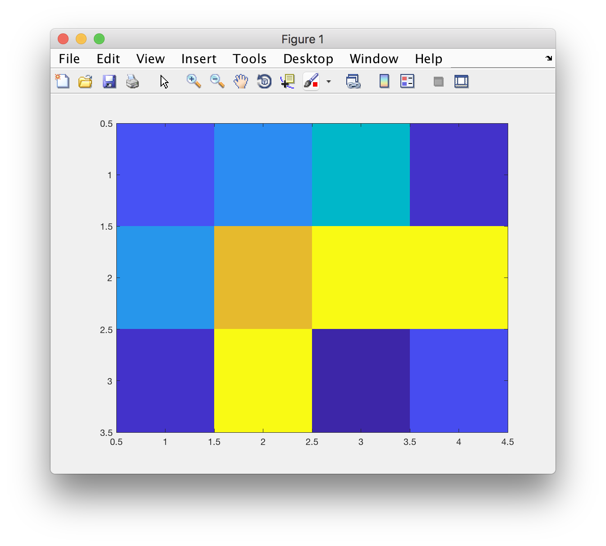

# imaging-00

In this unit we'll get to work with some imaging data (2d, 3d images) and see some of the matlab commands for interacting with and visualising it. Matlab has powerful functions / toolboxes to make this quite direct and I hope I'll be able to show you that you can achieve pretty amazing things with few lines of code -- as long as you know how to go about it (:smile:).

## Learning objectives

understand ...
- how *images* are represented in matlab
- how to display them, inspect different aspects
- the idea of *intensity* images, colormaps
- that there is a wealth of functionality available in the ``Image Processing Toolbox``
- that 3d images (volumetric data) is a natural extension of 2d images

## How are images represented?

You can think of images as a table of numbers. Consider this 3-by-4 example ``A``.

```Matlab
A = [10,20,30,4;
     22,51,72,89;
     4,100,0,9]
```

For larger images (tables with many rows and columns), looking at printed numbers becomes unwieldy. A much better way show this information is to show the numbers as little squares, also called ("pixels" for picture elements).

The following two lines of code

```Matlab
figure   % for a new window
image(A) % display A as an image
```

yield an image representation of the data in which each number is now represented as a colored pixel:



A few things to note:

0. the origin (1st row, 1st column of data) is shown in top left pixel. Compare this to how you think of a scatter plot... where is the origin in plots, usually?
1. note that the centres of each pixel are at 1, 2, 3, ... and each pixel takes up one unit in the x, y direction.
2. by default numbers (the values of each pixel) are mapped to colors
3. the table that defines those colors is called a **colormap**.


The following code displays the same matrix ``A`` as an image, then changes the colormap to ``gray()`` and also displays the colorbar with the correspondence between values and colours.

```Matlab
figure   % for a new window
image(A) % display A as an image
colormap( gray() )
colorbar() % show how values are mapped to colours
```


### Questions

Try to answer the following (and run the appropriate snippets of code). What does it mean? Do you understand what happened? If not, try describe in words what you see...

1. What happens when you run ``gray()`` on the command line.
2. Run ``g = gray()`` - this assigns something (what?) to the variable ``g``. How many rows and columns does ``g`` have?
3. What happens if you call the following:
```Matlab
% make a new figure
figure
% call image() or imagesc() without an input argument
imagesc()
% also try to add
colormap(gray())
axis('ij')
axis('image')
```


4. With the matrix ``A`` from above, try out:
```Matlab
figure(1)
imagesc(A)
axis('image')
title('Where is 0/0?')
```
and
```matlab
figure(2)
imagesc(A)
axis('ij')
axis('image')
title('Where is 0/0 now?')
```
Take note of the **origin** in both cases. So what does the ``axis('image')`` do and what's the idea behind ``axis('ij')`` and its cousin ``axis('xy')``?

## Loading and saving images

### Loading

For loading standard kinds of images (from digital cameras, webpages, etc.) the standard ``imread`` function is your friend. ``doc imread`` will show you all the options... on cool thing is that you can load images directly from the web:

The following image is located at: https://farm8.staticflickr.com/7038/6803949028_2469f89efc_z.jpg


```Matlab
% read it straight in
blueberry = imread('https://farm8.staticflickr.com/7038/6803949028_2469f89efc_z.jpg');
figure()
imshow(blueberry)
```

Try this out with an image you have locally on your machine. **Maybe via PhotoBooth** on the Mac, or downloaded into your ``/Documents/MATLAB/`` folder?

```Matlab
% read it straight in
someOtherImage = imread('blabla.jpg');
figure()
imshow(someOtherImage)
```

### Saving, writing images:

If you have some data in Matlab and you want to save it out as an image that you can use ``imwrite``, but you usually also have to provide the ``colormap`` to go along with it.

```MATLAB
randomImage = randi(64, [420, 130]);  % random integers [1...64] in a table
imwrite(randomImage, jet(),  'test_save_image.png')
% try out the next line and observe what happens... (mac only!)
!open test_save_image.png
```

Lots of other formats are supported. Check the documentation for specifics.

### Getting information about images

Also try the following with the image you have just created -- or any other images you want to try out.


```MATLAB
imageinfo('test_save_image.png')
```


## Look at what's possible

There is a wealth of functionality available in the ``Image Processing Toolbox``. Toolboxes are add-ons to basic Matlab and the university (or more generally, the customer) needs to pay for this. But most labs will have access to the **Image processing** and **Statistics** toolboxes, and many freely available toolboxes have been developed over the years.

```Matlab
% to get an overview of the Image Processing toolbox:
doc images
```
